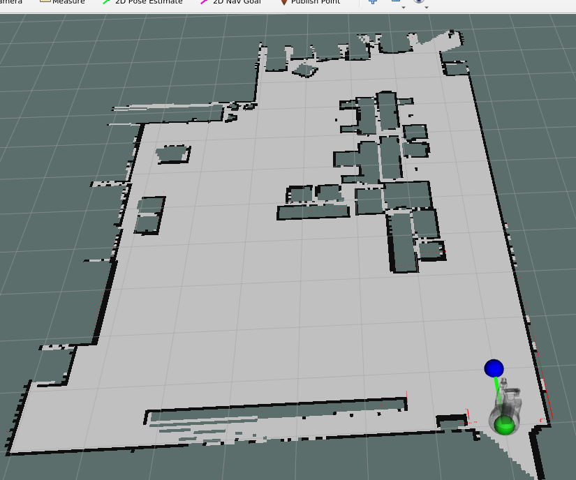
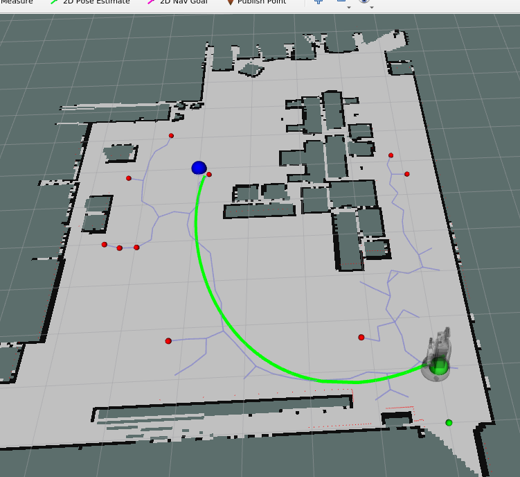
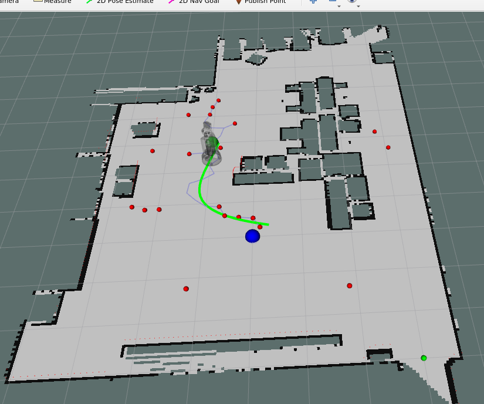
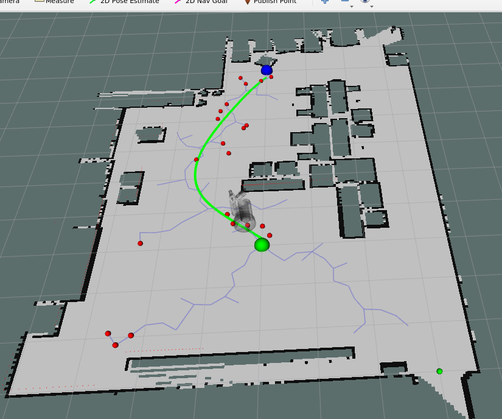

# RRT Path Planning

Rapidly-exploring Random Tree (RRT) based path planning and navigation for the Toyota HSR robot in a simulated environment. The robot plans collision-free paths from its current position to goal locations, with real-time obstacle detection and replanning.

## Technical Approach

### RRT Algorithm

The planner builds a tree of collision-free paths by repeatedly sampling random configurations and extending the nearest tree node toward them:

1. Sample a random point in the configuration space (with occasional goal-biased samples)
2. Find the nearest existing node in the tree
3. Extend toward the sample by a fixed step size, checking for obstacle collisions along the path
4. Repeat until the goal is reachable from the tree

### Implementation Details

- **Quick-path optimization:** Before running the full RRT, the planner checks if a direct line from start to goal is obstacle-free. If so, it skips tree construction entirely.
- **Obstacle inflation:** The occupancy grid is inflated by 5.0 grid cells around obstacles to ensure the robot maintains safe clearance during navigation, avoiding near-miss collisions without requiring more complex proximity checks.
- **Dynamic replanning:** If the robot detects an obstacle directly in front of itself during path execution (via laser scan), it stops and replans from its current position using a fresh RRT.
- **RViz visualization management:** Tree nodes, edges, and path markers use dedicated ID ranges (nodes: 1000-1999, paths: 2000+, start/goal: 3000+) to prevent marker ID collisions. A clear function removes all visualization artifacts between navigation tasks.

## Path Planning Results

|                                      |                                    |
| :----------------------------------: | :--------------------------------: |
|  |  |
|    |  |

## Key Files

| File                      | Description                                                          |
| ------------------------- | -------------------------------------------------------------------- |
| `scripts/rrt_students.py` | RRT planner, obstacle checking, path smoothing, and robot controller |
| `launch/`                 | ROS launch files for the planning environment                        |
| `rviz/`                   | RViz configuration for visualizing the tree and planned paths        |
