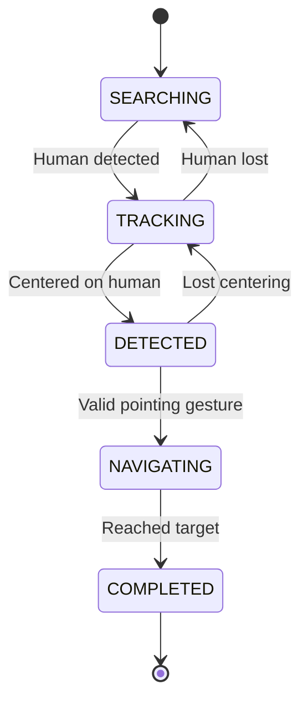

# Human Tracking & Gesture Recognition

Human tracking and pointing gesture recognition on the Toyota HSR platform. The system detects a human in the environment, tracks their position, interprets pointing gestures to identify a target location, and navigates toward it.

## Technical Approach

### State Machine

The system operates as a finite state machine with four states:

1. **SEARCHING** -- The robot rotates in place, scanning for a human using OpenPose skeleton detection.
2. **TRACKING** -- Once detected, the robot centers the human in its camera view using PID-controlled head pan/tilt and proportional base rotation.
3. **DETECTED** -- The system monitors for a pointing gesture. A valid gesture requires the arm to be extended (>50% of full length), straight (<25 degree deviation), and held steady for 3 seconds with stable direction.
4. **NAVIGATING** -- The robot computes the 3D pointed location and drives toward it using time-based dead reckoning (rotate to face target, then drive forward).

### Pointing Detection

- **OpenPose** extracts 25-keypoint skeletons from the RGB camera feed, with arm keypoints (shoulder, elbow, wrist) published separately for gesture analysis.
- **Face-to-hand vector method** (based on Azari et al.) computes a 3D pointing ray from the face centroid through the wrist, using depth data from the RGBD sensor.
- **Depth filtering** rejects background noise by sampling a circular region around each keypoint and using foreground-filtered median depth.
- **Ray-ground intersection** projects the pointing ray onto the ground plane (z=0 in the robot's base frame) via TF2 coordinate transformations to determine the target location.

### Isaac Sim Integration

The simulation environment uses NVIDIA Isaac Sim with a custom arm controller that spawns capsule geometry to animate human arm poses, working around Isaac Sim's skeletal animation limitations in standalone mode.

## Deliverables

- **[Paper](paper.pdf)** -- Full project report covering approach, implementation, and results

## Demos

### Human Tracking

The robot identifies and follows a human moving through the environment.

<https://github.com/AlexMorrow239/um-robotics/raw/main/human-tracking/human_track_demo.webm>

### Point Left Recognition

The robot detects a leftward pointing gesture and responds accordingly.

<https://github.com/AlexMorrow239/um-robotics/raw/main/human-tracking/point_left_demo.webm>

### Point Right Recognition

The robot detects a rightward pointing gesture and responds accordingly.

<https://github.com/AlexMorrow239/um-robotics/raw/main/human-tracking/point_right_demo.webm>

## Key Files

| File                                  | Description                                                                                  |
| ------------------------------------- | -------------------------------------------------------------------------------------------- |
| `scripts/human_point_follower.py`     | Core state machine -- human tracking, pointing detection, 3D ray calculation, and navigation |
| `scripts/openpose_bridge.py`          | ROS bridge for OpenPose skeleton detection, publishes keypoints and arm data                 |
| `world/human_arm_controller.py`       | Isaac Sim arm animation using spawned capsule geometry with ground truth publishing          |
| `world/human_point_follower_world.py` | Isaac Sim world setup -- robot, human, lighting, and physics                                 |
| `config/params.yaml`                  | All tunable parameters -- tracking PID gains, pointing thresholds, depth filtering           |
| `launch/`                             | ROS launch files for the detection pipeline                                                  |
