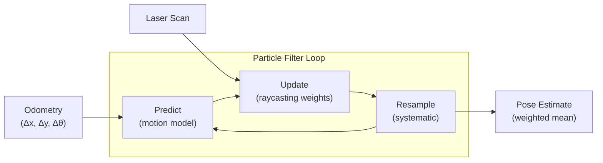

# Particle Filter Localization & Navigation

Autonomous localization and navigation system for the Toyota HSR (Human Support Robot) in a simulated lab environment using ROS and NVIDIA Isaac Sim. The robot localizes itself using a particle filter and navigates predefined routes through the lab.

## Technical Approach

### Particle Filter Localization

The system uses a Monte Carlo particle filter to estimate the robot's pose (x, y, theta) within a known map. Key design considerations:

- **Computational scaling:** The filter's cost scales linearly with the number of particles (N), requiring O(N) operations for prediction and resampling, and O(N \* M) for measurement updates where M is the number of sensor measurements.
- **Dimensionality constraints:** The number of particles needed for adequate state space coverage grows exponentially with the state dimension. For the 3D state (x, y, theta) used here, this remains tractable — but extending to higher-dimensional states (e.g., full 6-DOF) would require exponentially more particles or alternative approaches.
- **Weight degeneracy mitigation:** In practice, most particles can end up with negligible weights after a few update steps. The implementation uses systematic resampling to maintain an effective sample size and prevent particle depletion.

### Performance Optimizations

- **Numba JIT compilation** for raycasting operations, enabling real-time performance with large particle counts
- **Odometry correction** using ground truth transforms to compensate for simulation drift
- **Map preprocessing** pipeline converting raw occupancy grids into efficient lookup structures

## Key Files

| File                             | Description                                                                                              |
| -------------------------------- | -------------------------------------------------------------------------------------------------------- |
| `scripts/hsr_pf_localization.py` | Core particle filter implementation — prediction, measurement update, resampling, and RViz visualization |
| `scripts/hsr_lab_mover.py`       | Navigation controller — route execution, pose tracking, and movement commands                            |
| `scripts/hsr_simple_mover.py`    | Low-level motion primitives for the HSR                                                                  |
| `scripts/general_helpers/`       | Shared utilities for transforms, RViz markers, and geometry                                              |
| `maps/`                          | Raw and processed occupancy grid maps of the simulated lab                                               |
| `config/`                        | Move base parameters and predefined route waypoints                                                      |
| `launch/`                        | ROS launch files for different operating modes                                                           |
